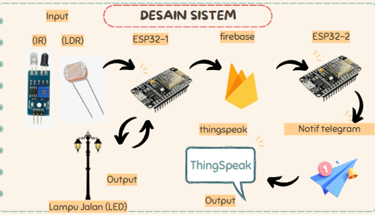
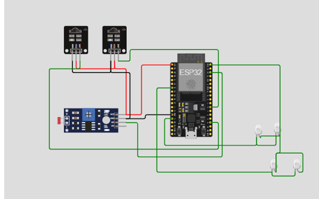
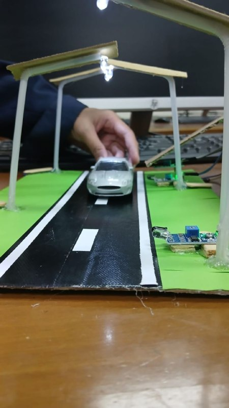
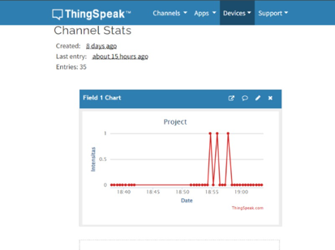
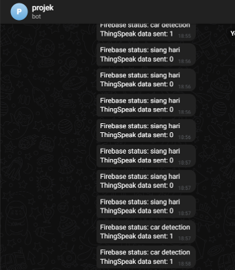

# IoT-Based Smart Street Lighting System

An IoT-based smart street lighting system developed using ESP32, LDR, and infrared (IR) sensors to automatically control street lighting based on ambient light intensity and vehicle detection. The system integrates Firebase Realtime Database, ThingSpeak, and Telegram Bot to provide cloud-based monitoring, data visualization, and real-time notifications.

## Overview

Traditional street lighting systems consume unnecessary energy because they operate continuously regardless of environmental conditions. This project addresses that issue by implementing an intelligent lighting system capable of automatically adjusting street lights according to surrounding light conditions and object detection.

The system utilizes ESP32 as the main controller, LDR sensors to determine day and night conditions, and IR sensors to detect passing vehicles. System status is synchronized with Firebase Realtime Database, visualized through ThingSpeak, and notifications are sent via Telegram Bot.

---

## Features

- Automatic day/night detection using an LDR sensor
- Vehicle detection using infrared (IR) sensors
- Adaptive LED brightness control
- ESP32-based embedded control system
- Firebase Realtime Database integration
- ThingSpeak cloud monitoring
- Telegram Bot real-time notifications
- Wi-Fi communication

---

## System Architecture

The system consists of two ESP32 boards:

- **ESP32 #1**
  - Reads LDR and IR sensor data
  - Controls LED brightness
  - Sends system status to Firebase

- **ESP32 #2**
  - Retrieves data from Firebase
  - Uploads data to ThingSpeak
  - Sends notifications through Telegram Bot

---

## Hardware Components

| Component | Quantity |
|-----------|---------:|
| ESP32 | 2 |
| IR Sensor | 2 |
| LDR Sensor | 1 |
| LEDs | 4 |
| Breadboard | 1 |
| Jumper Wires | As required |

---

## Technologies

- ESP32
- Arduino IDE
- C++
- Firebase Realtime Database
- ThingSpeak
- Telegram Bot API
- Wi-Fi
- Internet of Things (IoT)

---

## Project Gallery

### System Architecture

> Overall architecture of the IoT-based smart street lighting system.

---

### Hardware Circuit

> Wiring diagram of the ESP32, LDR, IR sensors, and LEDs.

---

### Hardware Prototype

> Physical implementation of the smart street lighting prototype.

---

### Cloud Monitoring

> Real-time data visualization using ThingSpeak.

---

### Telegram Notification

> Automatic notification generated whenever the system status changes.

---

## Future Improvements

- Replace IR sensors with ultrasonic or camera-based vehicle detection.
- Integrate energy consumption monitoring.
- Develop a web dashboard for remote management.
- Add OTA (Over-the-Air) firmware updates.
- Improve scalability for multiple street lighting nodes.
